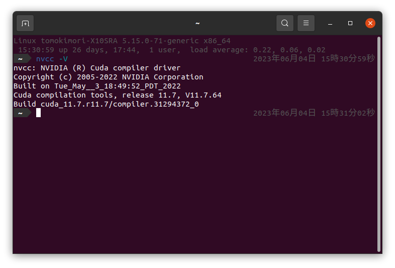
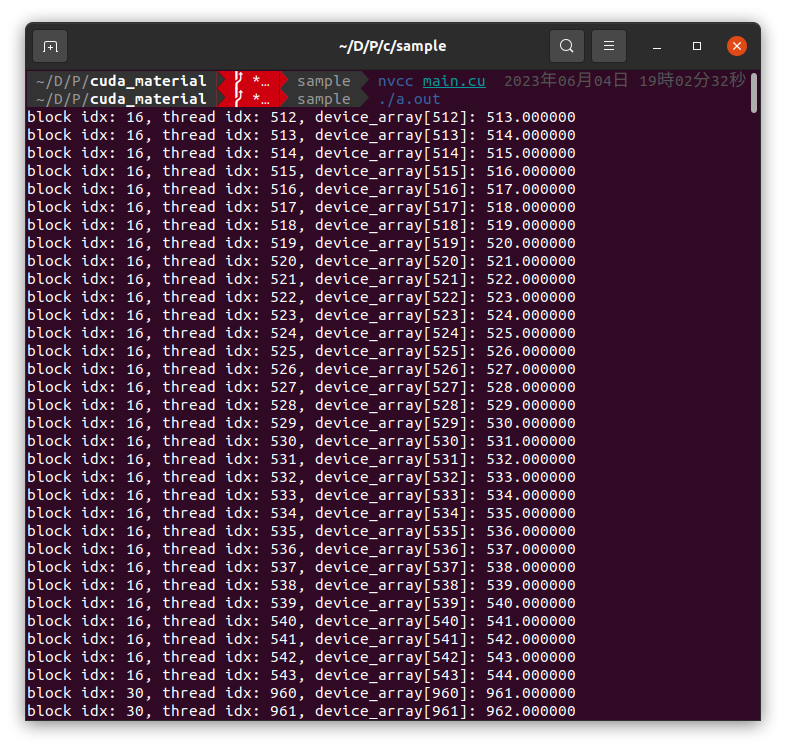
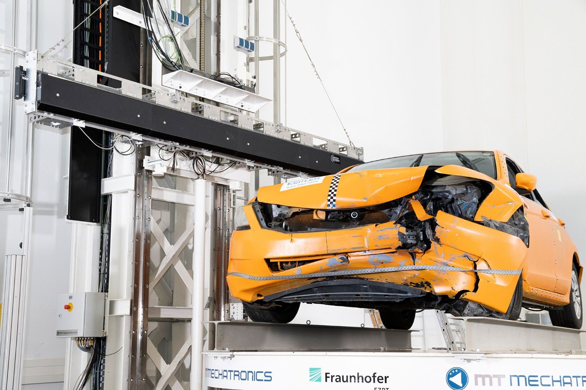
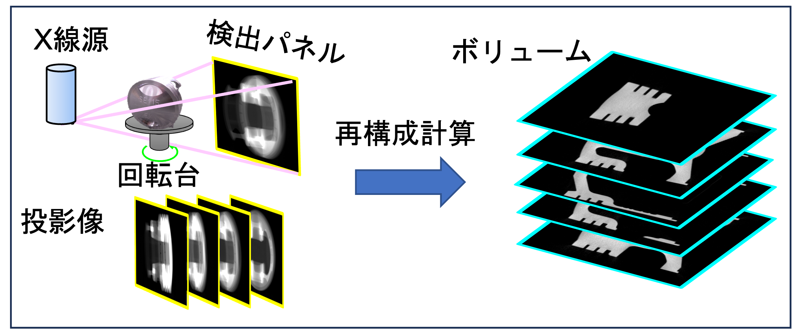
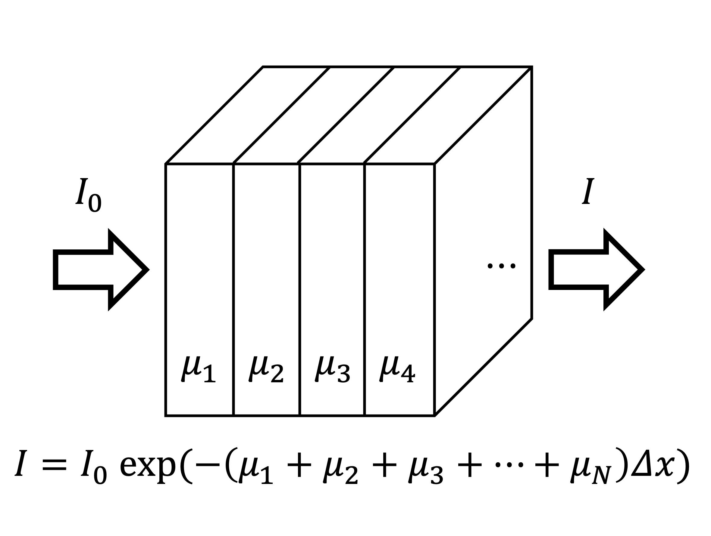
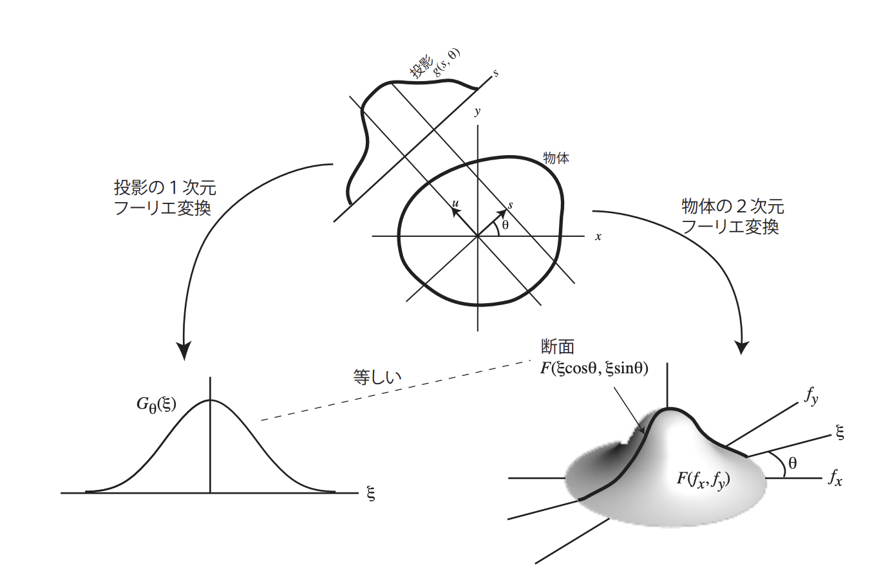
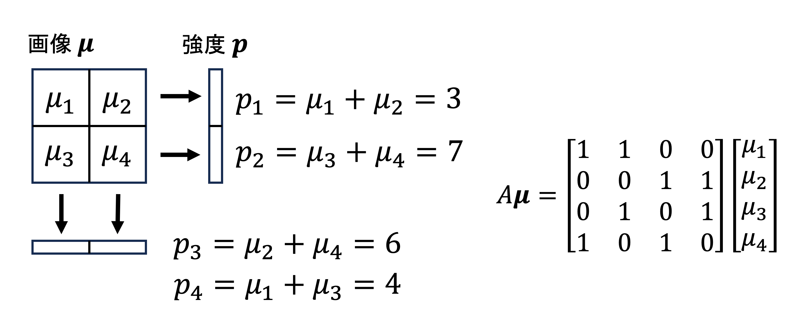
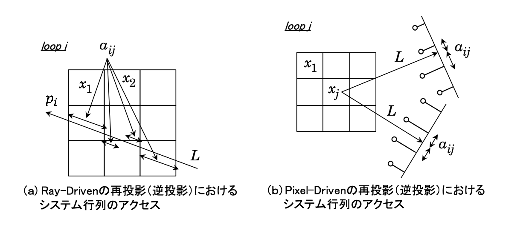
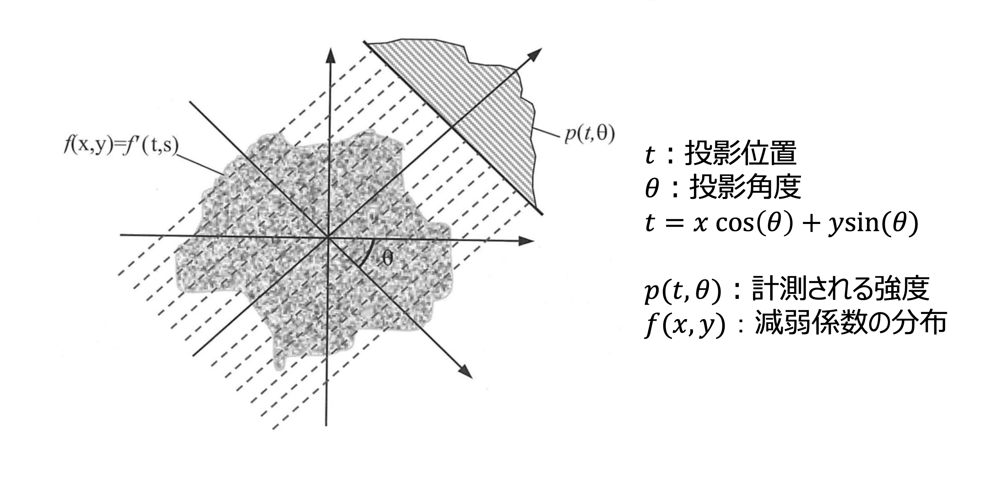
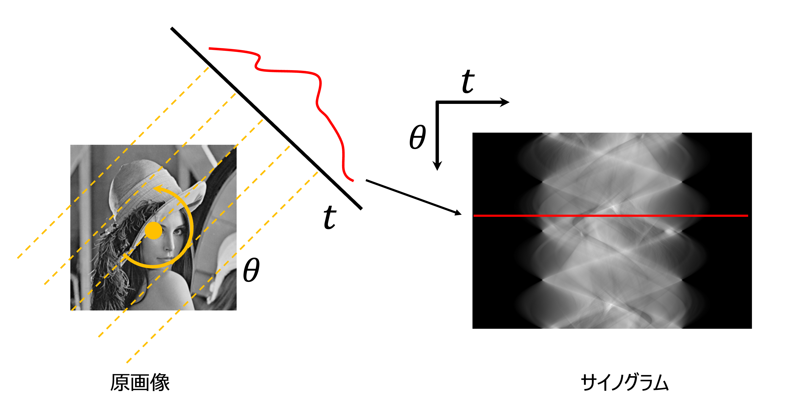

<script type="text/x-mathjax-config">MathJax.Hub.Config({tex2jax:{inlineMath:[['\$','\$'],['\\(','\\)']],processEscapes:true},CommonHTML: {matchFontHeight:false}});</script>
<script type="text/javascript" async src="https://cdnjs.cloudflare.com/ajax/libs/mathjax/2.7.1/MathJax.js?config=TeX-MML-AM_CHTML"></script>


# GPUによるプログラミング入門
## CUDAとは
**CUDA**(Compute Unified Device Architecture)はNVIDIA社によるGPUプログラミング開発環境です。通常、一般的なコンピュータはCPUを使用して計算を行いますが、 CUDAを使用することでGPUも計算に利用することができます。
GPUは、多数のコアと高い並列処理能力により、 **並列化が可能な演算**を高速に処理することができます。（単一の処理自体は速くないことに注意）
CUDAは、CやC++をベースとしたプログラミングモデルを提供しており、GPUを使用した並列計算を容易に実装することができます。GPUの性能を真に引き出して高速化したい場合にはハードウェアアーキテクチャに対する理解が必要になるため、難しいです（自分もあまり分かっていません）。逆に言うとハードウェアを意識したプログラミングも可能であると言うことです。  

## CUDAプログラミング
CUDAで出来ることは、単一の命令を与えて、複数の処理を行うことです。（SIMT: Single Instruction Multiple Thread , SPMD: Single Program Multiple Data など）  
そこでCUDAでは、C，C++で書かれた関数に対して並列化をかけることによって高速化を目指します。ここでは、並列化するための準備を行なっていきます。
### 1. CUDAとCの相違点
CUDAは基本的にはC言語とほとんど相違はありません。そのため、Cで書かれたプログラムに関してはそのまま動作すると思われます。
CUDAではCに対して大きく2つの拡張がなされています。
1. ホストメモリ（CPU）とデバイスメモリ（GPU）間でデータを転送する機能
2. ホスト（CPU）から、デバイス（GPU）に対して、多数のスレッドを並列に命令を与える機能  
   
CUDAのパラダイムでは、CPU側を**ホスト**、GPU側を**デバイス**と呼びます。1について、ホストとデバイスは異なるメモリシステムとなっているため、ホスト側からデバイスメモリを参照することは出来ません（逆も然り。厳密には異なるかもしれないが、大まかにはRAMがホストメモリ、VRAMがデバイスメモリと思ってもらって良い）。そのため、並列計算に必要となるボリュームデータや点群データなどの入力データはデバイスメモリに事前に転送して置く必要があります。また、計算後の出力データもデバイスからホストへと転送しなければなりません。2についてはそのままの意味で、並列計算の命令を与えます。基本的にはforループなどの、indexが変わるけれど、実行内容が変わらないような命令を並列化することになるでしょう。  

### 2. 準備
CUDAはNVIDIA社製のGPUにのみ対応しているため、GeForceやTesla, QuadroのGPUが必要になります。
### 2.1. インストール
[公式ページ](https://developer.nvidia.com/cuda-downloads)から自身が利用している環境を選択してインストーラーを入れましょう。([インストールガイド](https://docs.nvidia.com/cuda/cuda-quick-start-guide/index.html))  
インストーラの指示に従ってインストールを行ってください。インストールが行われれば、`nvcc`というCUDAコンパイラが導入されているはずです。正しくインストールされたかどうかは`ncvv -V`というコマンドで確認してください。  
  
ソースコードをコンパイルする場合は、`gcc`や`clang`と同様、`nvcc main.cu`のようなコマンドでコンパイルが可能です。CUDAで実装したソースコードの命名規則ですが、ソースファイルであれば`*.cu`、ヘッダファイルであれば`*.cuh`のように命名します。  
プロジェクトが大きくなってくると、IDEを用いた管理をすると楽でしょう。**CLion**や**Visual Studio**によるプロジェクト管理を行いましょう。CLionならば[こちら](https://pleiades.io/help/clion/cuda-projects.html)を、VSならば[こちら](https://docs.nvidia.com/cuda/cuda-installation-guide-microsoft-windows/index.html?highlight=visual%20studio#build-customizations-for-existing-projects)を参考にしてみてください。


### 3. プログラミングの流れ
一般的なCUDAプログラムの構造は主に以下の5つのstepに分かれます。
1. GPUメモリの確保
2. CPUメモリからデータをGPUメモリにコピー
3. CUDAカーネルを呼び出し、並列計算を実行する
4. GPUメモリからデータをCPUメモリにコピー
5. GPUメモリの解放

実際に書くと以下のようなプログラムになるでしょう。ここでは与えた配列に対して全要素に1を足すというプログラムを例として示します。

```c++
#include <cuda_runtime.h>
#include <stdio.h>

__global__ void plusOneArray(float* array) {
    unsigned int u = blockDim.x * blockIdx.x + threadIdx.x;
    array[u] += 1.0f;
    printf("block idx: %d, thread idx: %d, device_array[%d]: %f\n", blockIdx.x, u, u, array[u]);
}

int main() {
    int N = 1024;
    // init host memory
    float host_array[1024];
    for(int i = 0; i < N; i++)
        host_array[i] = (float)i;
    // init device memory
    float* device_array;

    // 1. allocate device memory
    cudaMalloc((float**)&device_array, sizeof(float) * N);

    // 2. memory copy host to device
    cudaMemcpy(device_array, host_array, sizeof(float) * N, cudaMemcpyHostToDevice);

    // 3. call kernel function
    int blockSize = 32;
    dim3 block(blockSize, 1, 1);
    dim3 grid((N + blockSize - 1) / blockSize, 1, 1);
    plusOneArray<<<grid, block>>>(device_array);
    // parallelize -> for (auto &e : host_array) e+= 1.0f;

    // 4. memory copy device to host
    cudaMemcpy(host_array, device_array, sizeof(int) * N, cudaMemcpyDeviceToHost);

    for(int i = 0; i < N; i++)
        printf("host_array[%d]: %f\n", i, host_array[i]);

    // 5. free device memory
    cudaFree(device_array);
}
```

どうでしょうか。途中見慣れない表記もあったかと思いますが、main関数だけに関して言えば基本的にはC言語と同じく、mallocで領域を確保して、計算して、freeによってメモリを解放する・・・といった普遍的な流れですね。  

### 3.1. メモリ確保と解放
GPUのメモリを確保するために**デバイスで利用するためのポインタ**をホスト側で宣言します。(ここでは```int* device array```)  ホストとデバイス間でやり取りがしたいデータがある場合には必ずこの前段階で宣言する必要があります。  
ポインタを宣言したら、```cudaMalloc(void** ptr, size_t nbytes)``` により **デバイスメモリ**に領域を割り当てます。ここから先はもう```cudaMalloc```により割り与えられた領域は**ホスト側から参照することは出来なく**なります。使い終えたら、```cudaFree(void* ptr)```によってデバイスメモリを解放してあげましょう。

### 3.2. データ転送
2, 4ではホストメモリ、デバイスメモリ間のデータのコピーを行います。```cudaMemcpy(void *dst, void *src, size_t nbytes enum cudaMemcpyKind)```によってメモリコピーを行います。cudaMemcpyKindに関してはHost から Deviceへのコピーならば```cudaMemcpyHostToDevice```を選べば良いです。初期化に関してはcudaMemset等もあるので調べてみてください。

### 3.3. 並列処理
### 3.3.1. カーネル関数
並列処理を行う関数を見ていきます。GPUデバイス上で実行されるコードのことを**カーネル**と呼びます。今回では、```__global__ void plusOneArray()```で示される関数に当たります。カーネル関数を定義するときには、`__global__`という修飾子が必要となります。また、`__global__`関数内で呼び出す関数を定義するためには`__device__`修飾子を宣言して関数を定義する必要があります。 `__device__`関数はデバイスからの呼び出し限定であり、ホストからは呼び出せません。また、カーネル関数の返り値には**void**型しか許されていないことに注意してください。
ホストからカーネル関数を呼び出すとデバイスでの実行に移ります。デバイス内では大量のスレッドが生成され各スレッドで処理が実行されます。   
ちなみに、カーネルが呼び出されるとすぐに制御がホストに戻るため、カーネルがGPUで実行されている間にホスト側では他の関数を実行することができます。 また、カーネル関数に渡した引数は自動的にメモリが確保されますので、`int`や`float`などの定数はそのまま引き渡すことができます。  
注意点として、c++でよく用いられているSTL(Standard Template Library)などをカーネルに渡しても正常に動作はしないので（コンパイルできない？）、cベースで記述する必要があります。

### 3.3.2. スレッドの構成
CUDAでは**スレッド**は階層状に抽象化されています。スレッド階層は複数のスレッドが集まった**ブロック**と、ブロックが複数集まった**グリッド**の2層構造からなります。グリッド内のスレッド間では、全て同じグローバルメモリ空間を共有します。  
このスレッド数とブロック数を決定することで**並列化のサイズ**が決定されます。そのため、特定の並列化サイズに基づいてグリッドとブロックのサイズを決定する必要があります。

**スレッドの構成**（[CUDA C Programming Guide](https://docs.nvidia.com/cuda/cuda-c-programming-guide/index.html)より）
  

### 3.3.3. グリッドの決定
並列数を決定づけるスレッド数はグリッドサイズとブロックサイズをホストで定義することにより決まります。CUDAでは、グリッドとブロックは3次元で構成されます。これにより、画像や体積などの領域内の要素にまたがる計算を自然に行うことができます。サイズは、```dim3 block(sizeX, sizeY, sizeZ)```のように決定されます。基本は```int blockSize = 32```のようにブロックサイズを先に決めて、並列化したいサイズNから、  
```c
dim3 block(blockSize, 1, 1);
dim3 grid((N + blockSize - 1) / blockSize, 1, 1);
```
のように並列数を決定をします。この場合、```blockSize * (N * blockSize - 1) / blockSize```分のスレッドが実行されることになります。

### 3.3.5. スレッドのインデックス
所望の処理をカーネル関数に書いていくことになると思いますが、カーネル内部では、どのようにスレッドの番地を知ることができるのでしょうか。`__global__`関数内には、スレッドは互いを区別するために以下の組み込み変数が用意されています。
```c
blockDim.x
blockIdx.x
threadIdx.x
```
`blockDim`は**ブロックサイズ**、`blockIdx`は**ブロックのインデックス**、`threadIdx`は**ブロック内におけるスレッドのインデックス**を示しています。そのため、グリッド内のスレッドのインデックスは次のように表せます。
```c
unsigned int u = blockDim.x * blockIdx.x + threadIdx.x;
unsigned int v = blockDim.y * blockIdx.y + threadIdx.y;
unsigned int w = blockDim.z * blockIdx.z + threadIdx.z;
```
このようにグリッド内のスレッドを**一意に識別する**ことができるので、スレッドとデータ要素とのマッピングが可能になります。
今回のコードではスレッドの番地を用いて配列の番地を指定して、要素に+1しています。 

なお、並列数がブロックサイズで割り切れず、スレッド数が配列の要素数を超えてしまう場合があります。そのため、次のような要素数を超えたインデックスに関しては処理を行わないといった記述が行われます。
```c
__global__ void function(float* matrix, int row, int col) {
    unsigned int u = blockDim.x * blockIdx.x + threadIdx.x;
    unsigned int v = blockDim.y * blockIdx.y + threadIdx.y;
    if (u > row || v > col) return; // over matrix array length

    matrixCalc(matrix, u, v);
}
```

### 3.3.6. カーネルの起動
準備は整ったのでカーネルを起動しましょう。ホストから、`function<<<grid, block>>>()`のように実行します。
このように実行すれば、事前に設定しておいたグリッドサイズとブロックサイズに従ってスレッドが起動し、処理が行われます。  
内部の動作としてはカーネルの実行はブロック単位ごとに行われていきます。今回のコードだと、32スレッドごとの処理が32回行われることになりますね。  
もう少し厳密に話すと、スレッドが32個ずつ、ワープ(warp)と呼ばれるグループにまとめられた上で実行されます。ワープスケジューラによって32個のスレッド分のワープに分割され、利用可能なハードウェアのリソースに割り当てられていきます。

### 3.4. コードの検証
さて、動作を確認していきましょう。前述したように`nvcc`コマンドを用いて`nvcc main.cu`でコンパイルすると、実行ファイル`./a.out`が生成されますので、実行します。
カーネル関数内では`printf`が使えますので今回は`printf`でスレッドの番地と実際に配列の要素に対して+1されているかどうかを確認した結果です。for文なしに全ての配列にアクセスして計算できています。特徴的なのは、ブロックごとにカーネルが走っているのがなんとなく分かるところでしょうか。
 

そしてホストメモリにコピーした後の結果も見てみましょう。

ホスト側で計算はしていませんが、ちゃんと`host_array`の値が更新されたことを確認できました。
 

## まとめ
というわけでざっくりとCUDAについて見てきました。（公式のCUDA Cプログラミングガイドの100分の1くらいです）  
どう並列化させるかがミソだと思うので、色々試してみてください。  
次はCT画像再構成を具体例として、プログラムを見ていきたいと思います。


### 以下Tips
#### T.1. クラスをglobal関数に渡した後に内部でメンバ関数を実行できるか
#### T.2. Shared Memoryを使って高速化
#### T.3. cudaMallocManagedでホストとデバイスから参照しよう
#### T.4. mallocとfreeがめんどくさい時は
#### T.5. async allocation
#### T.6. マジックナンバー 32
#### T.7. thrustを使ってコードをきれいに

## 参考資料  
一次情報 

CUDA全般について（[CUDA Toolkit Documentation](https://docs.nvidia.com/cuda/)）  
CUDA Programmingの全て（[CUDA C Programming Guide](https://docs.nvidia.com/cuda/cuda-c-programming-guide/index.html)）   
CUDA 環境構築 （[CUDA quick start guide](https://docs.nvidia.com/cuda/cuda-quick-start-guide/)）  
公式サンプル （[cuda-samples](https://github.com/NVIDIA/cuda-samples)）

二次情報

CUDA全体についてわかりやすくまとまっているサイト [See This](https://www.slis.tsukuba.ac.jp/~fujisawa.makoto.fu/cgi-bin/wiki/index.php?CUDA)

# CT画像再構成
## X線CTとは
**X線CT（X-ray Computed Tomography）** は、私たちの研究室でのコンテクストでは、産業分野における非破壊検査技術として扱われており、製品や材料の内部構造を詳細に可視化するために使用されます。（画像は超大型CT装置、[fraunhofer IIS](https://www.iis.fraunhofer.de/en/ff/zfp/tech/hochenergie-computertomographie.html)より引用）  

<div align="center">
 
</div>
   
X線CTは、X線と検出器を組み合わせて使用します。被検査物にX線を照射し、その後、検出器がX線の**透過率**を測定します。これにより、被検査物の内部でのX線の**線減弱係数**（物質の密度に比例）や散乱強度のパターンを得ることができます。

CT再構成のプロセスについて説明します。まず、複数の角度からのX線撮影を行います。非検査物がX線源と検出器の間を回転しながら、被検査物を一定の回転間隔でスキャンします。このプロセスにより、被検査物周囲の透過率の断層画像が取得されます。取得された断層画像から再構成計算を行うことにより、最終的な三次元の内部構造を表現することができます。   

<div align="center">
 
</div> 

再構成の方法には、**フィルター逆投影法（FBP: Filtered Back Projection）** と **逐次近似再構成法（IR: Iterative Reconstruction）** に大別されます。今回の実装では逐次近似再構成法について実装していきたいと思います。  

## ランベルト・ベールの法則
再構成の説明に入る前に一度、投影像で得られる像の値（物体通過前のX線の強度$I_0$, 通過後のX線の強度$I$）と線減弱係数 $\mu$ との関係について説明します。X線が物体を通り抜ける前後のX線強度の関係は次の式で表せることが知られています。  

\\[
    I = I_0 \exp(-\mu \Delta x) 
\\]

これを**ランベルト・ベールの法則**と言います。ここで$\Delta x$はX線の通過距離になります。CT再構成によって求めたい値は線減弱係数$\mu$なので、両辺で対数をとった形で表記されることが多いです。  

\\[ 
    p = -\ln \left(\frac{I}{I_0}\right) = \mu \Delta x 
\\]  
  
ここで、次の系を考えてみましょう。  
線減弱係数の異なる、幅$\Delta x$のブロックがいくつも並んでいるところをX線が通過するような系です。  

<div align="center">
 
</div>

この場合、1ブロックごとのX線通過前後の強度比は$\exp(-\mu_i \Delta x)$で表されることになりますから、全体を通せば図中の関係式が成り立ちます。
この1ブロックを細かく見ていくとどうなるでしょうか。$\Delta x\rightarrow0$を取ると次の式が成り立ちます。  

\\[ 
     p = -\ln \left(\frac{I}{I_0}\right) = \int_{L}^{} \mu(x) dx
\\]  

以上から、X線通過前後の強度比の対数が、**線減弱係数の線積分**で表されることを確認しました。（1方向のRadon変換）  
いずれの再構成手法においても、さまざまな方向から得た$p$から$\mu(x)$を求めるのが目的となります。


## フィルター逆投影法
今回はフィルター逆投影法については実装しませんが、簡単に説明だけします。フィルター逆投影法は、得られた投影像に対して特定の周波数フィルターを掛けた後に、投影線上に投影値を加算していく手法になります。  
  
理論を学ぶ場合はこちら（[Radon変換](http://racco.mikeneko.jp/Kougi/2012s/IPPR/2012s_ippr12.pdf)と[フィルター逆投影](http://racco.mikeneko.jp/Kougi/2012s/IPPR/2012s_ippr13.pdf)）がよくまとまっていて分かりやすいと思います。   
以下概略  
投影像分布を $$g(s, \theta)$$ 、再構成領域における物体の分布を $$f(x, y)$$ としたとき、 $f(x, y)$ を2次元フーリエ変換したときに現れる関数 $F(u=\xi cos\theta, v=\xi sin\theta)$ が、投影像の1次元フーリエ変換 $G(\xi, \theta)$ と合致すること（投影定理）を利用することにより導出される。極座標変換時に現れる係数であるRampフィルタ $\lvert\xi\rvert,(-\infty<\xi<\infty)$ が理想的なフィルタである。が、有限の領域でカットする必要があるので、特定のフィルタを選択する必要がある。    

**投影原理**


## 逐次近似再構成法
### 概要
議論を簡便にするために、今回は2次元に限定して話を進めることにします。  

逐次近似法では、各ピクセルに線減弱係数を持つ`画像` $\boldsymbol \mu$と`投影像`$\boldsymbol p$、その2つの関係を結ぶ`システム行列`$A$によって記述される系
\\[
    A\boldsymbol \mu = p
\\]
を反復法によって解くことが目標となります。

簡単な例を考えましょう。2×2のピクセルで構成された再構成領域に対して上下左右からの線積分の値 $p$ が求まっているとします。この時、**強度と画像の間の関係を結ぶ行列**がシステム行列になります。ちなみに、例で示した系では画像が（多分）一意に定まり、それぞれ画像のインデックスが画素値になっています。  

<div align="center">
 
</div>  
  

今回は非常に簡単な系を考えましたが、実際には、例えば画像のサイズが128x128、検出器で得られる強度分布が128回転方向x128ピクセルだとすれば、16,384元の連立一次方程式のように非常に大きなサイズとなることから直接法ではなく反復法によって解を求めることになります。反復法では、仮定した画像の順投影で求めた予測投影データ $p$ と計測で得られている実測投影データ $p'$ を比較することにより画像を更新します。  

### 実装の流れ
どのような手法であれ、CTにおける逐次近似は概ね以下のような流れに従って実装を行うことになるでしょう。  

1. （初期化）初期画像 $\boldsymbol \mu^{(0)}$ を与える。
2. （順投影）現在の更新画像 $\boldsymbol \mu^{(k)}$ から投影データ $\boldsymbol p = A \boldsymbol \mu^{(k)}$ を生成する。
3. （比較）予測投影データ $\boldsymbol p$ と実測投影データ$\boldsymbol p' $ を比較して誤差ベクトル $ \boldsymbol r$ を求める。
4. （逆投影）誤差ベクトル $\boldsymbol r$ に $A^\top$ をかけて画像修正係数ベクトル $\boldsymbol e$ を算出する。ここで $A^\top$ は逆投影を意味する演算となる。
5. （画像修正）画像修正ベクトル $\boldsymbol e$ を元に画像を修正する。すなわち、$\boldsymbol x^{(k+1)} = \boldsymbol x^{(k)} + D \boldsymbol e$ のような形を取る。 ただし、$D$ は画素ごとの画像修正量を決める対角行列である。  

ここで重要なのが順投影演算を表す $A$ 及び逆投影演算を表す$A^\top$ でしょう。しかし、通常はシステム行列 $A$ そのものを求めることはなく、X線の光線を飛ばして再構成領域の線積分を行うことで、結果的に投影演算を行うといった形式を取ることが一般的です。   
投影演算には2種類の方法が存在します。**Ray-driven方式**と**Pixel(Voxel)-driven方式**です。  

**Ray-driven**は、検出器のピクセル位置に対して光線を飛ばし、通過した画像のピクセルの値×通過したピクセル領域の距離を予測投影データの値とする演算方法です。なので投影データのベクトルの長さ分の回数の計算を要します。pureな線積分と言えるでしょう。  

**Pixel-driven**は、画像のピクセル中心に光線を飛ばし、通過した画像のピクセル値×通過したピクセル領域の距離×検出器のピクセル間を内分する値を順次加算することで予測投影データを求める方法です。こちらは再構成する画像の画素分の回数の計算を要します。  


  
いずれの方法でも構いませんが、数値計算の誤差の関係から順投影計算と逆投影計算で同じ手法を選択することが望ましいとされています。

### SIRT法
具体的な再構成手法を確認していきます。今回は加算型更新則で知られる**SIRT(Simultaneous Iterative Reconstruction Technique)法**を実装します。  

SIRT法は予測投影データ $\boldsymbol p$ と実測投影データ $\boldsymbol p'$ の差分値 $\boldsymbol p - \boldsymbol p'$ を誤差ベクトルとし、それを元に逆投影することで得られる画像 $A^\top (\boldsymbol p - \boldsymbol p')$ を更新前画像に加算することによるフィードバック補正をかける手法になります。  

感覚的にもこの方法で再構成画像が得られそうですが、簡便に理論に立ち返ってみます。  
SIRT法は、モデル $A \boldsymbol\mu=\boldsymbol{p}$ を最小二乗法で解く手法です。すなわち評価関数 
\\[ J(\boldsymbol{\mu}) = {|\boldsymbol p - A \boldsymbol{\mu}|}_2^2 
\\]  
を定義し、評価関数を最小化する画像 
\\[
    \boldsymbol{\mu} ^\star = \argmin J(\boldsymbol{\mu})
\\]
を求めます。 $\boldsymbol\mu$ について評価関数を解くと、 
\\[
A^\top A \boldsymbol\mu=A^\top\boldsymbol{p}
\\]
となります。この方程式をLandweber法と呼ばれる反復解法で解くと次の反復式が得られます。  
\\[
\boldsymbol \mu^{(k+1)} = \boldsymbol \mu^{(k)} + \alpha A^\top\left(\boldsymbol p - A \boldsymbol\mu^{(k)}\right)
\\]
ここで $\alpha$ はステップサイズになります。収束性を保証するにはある定数以下にする必要があります。  

この式の意味をCT再構成の枠組みで再考察してみましょう。  
重要なのは右辺第二項です。誤差ベクトルについて、 $\boldsymbol e = \boldsymbol p - A\boldsymbol \mu$ のように実測投影データと予測投影データの**差分値**として算出したのち、その誤差ベクトルの逆投影 $A^\top \boldsymbol{e}$ を画像に加算することによって画像を更新しています。  
以上からSIRT法は、原画像 $\boldsymbol \mu$ を実測投影と予測投影との最小二乗問題を解くことで得る手法であることを示しました。


### 実装
今回の実装では、X線が**平行ビーム**、検出器が**フラットな1列型**を仮定しています。（通常、産業用CTスキャナであれば、コーンビーム型のX線光源かつ検出器には平面のパネルディテクタを用いて3次元に再構成されることが多いです。ですが3次元になっても光線の軌跡計算が異なるだけで、基本的な考え方は変わりません。）
  
ジオメトリ


今回は画像処理でよく見るLennaさんを投影したデータを用いて再構成をしてみたいと思います。  
ここで投影データの見方について説明します。CTにおける投影像列のことを **サイノグラム(Sinogram)** と呼びます。3次元の場合は検出器に投影像が写るのでイメージしやすいですが、2次元の場合は特徴的なデータ配列になります。

サイノグラム

  
CPUrecon/sirt.hに実装内容があります。  
前述した実装の流れに従い、順投影である`forward`関数、実測と投影データの差分を求める`calc_error`関数、誤差ベクトルを逆投影する`backward`関数、逆投影によって求めた修正項を加算する`feedback`関数に分かれています。以上の機能をまとめた`SIRT`関数では、この4つの関数を繰り返し計算することにより再構成が行われます。  

特に重要なのが、投影計算を行なっている`for(back)ward`関数でしょう。今回はpixel-driven方式を取っているので、再構成領域のピクセルごとに投影計算を行なっています。  
順投影では、光線がヒットする場所の検出器ピクセルに再構成画像の値を加算していくことになりますから、注目しているピクセルの中心位置から、検出器のインデックスを求める必要があります。幸い、平行ビーム、フラットな検出器の場合、$t=x\cos(\theta) - y\sin(\theta)$ で光線がヒットする場所が求まります。  

検出器への加算方法については、今回はヒットした光線が周辺の検出器に影響を与えるものと仮定して、biliner補間によって強度を与えます。

```c
    // 順投影によるsinogramの生成
    // 投影角ごとに順投影計算を行い、sinogramに線積分値を加算する
    for (int k = 0; k < n_proj; k++) {
        for (int i = 0; i < geom.img_width; i++) {
            for (int j = 0; j < geom.img_height; j++) {
                x = img.co_x(i, pix_size);
                y = img.co_y(j, pix_size);

                // 再構成画像の(i, j)インデックスの座標から、検出器のインデックスを求める
                t = ((x * std::cos(theta) - y * std::sin(theta) + det_size *
                        (float) (geom.detect_width - 1) / 2.0f)) / det_size;
                int t_idx = std::floor(t);
                if (t_idx < 0 || geom.detect_width - 2 < t_idx) continue;
                sinogram(t_idx, k) += img(i, j) * pix_size * ((float) t_idx + 1.0f - t);
                sinogram(t_idx + 1, k) += img(i, j) * pix_size * (t - (float) t_idx);

            }
        }
        theta += d_theta;
    }
```

上記による計算を行なった結果がこちらです。  
復元できていますが、何となくぼやけているかと思います。SIRT法の特徴として、収束が遅いことと、高周波な成分の復元が難しいことが知られています。

再構成画像


## まとめ
今回は研究内容をフォローするための基礎知識として、CT再構成について解説しました。何となく、何をしているのかを理解してもらえたら幸いです。

## 課題
1. **CUDAをインストールして、実際に動かしてみよう。**  
   環境依存なところも大きく、あえてインストールや環境構築に関する解説は薄めにしました。ここを乗り切れば難しいところは少ないと思います！

2. CPUで実装されているSIRT法をCUDAに移植してみよう。（ご自身で進めているプロジェクトなど、他に使いたい局面があった場合、その実装をしてみてください。どのようなことを並列化したのか、また速度の変化などの結果を教えてください。）