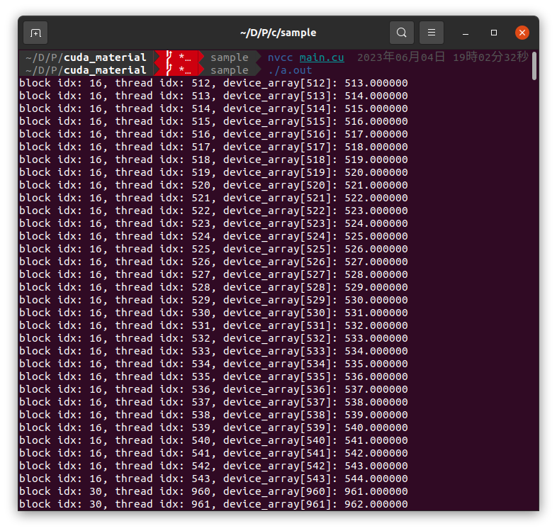

# 講習会
## CUDAとは
**CUDA**(Compute Unified Device Architecture)はNVIDIA社によるGPUプログラミング開発環境です。通常、一般的なコンピュータはCPUを使用して計算を行いますが、 CUDAを使用することでGPUも計算に利用することができます。
GPUは、多数のコアと高い並列処理能力により、 **並列化が可能な演算**を高速に処理することができます。（単一の処理自体は速くないことに注意）
CUDAは、CやC++をベースとしたプログラミングモデルを提供しており、GPUを使用した並列計算を容易に実装することができます。GPUの性能を真に引き出して高速化したい場合にはハードウェアアーキテクチャに対する理解が必要になるため、難しいです（自分もあまり分かっていません）。逆に言うとハードウェアを意識したプログラミングも可能であると言うことです。  

## CUDAプログラミング
CUDAで出来ることは、単一の命令を与えて、複数の処理を行うことです。（SIMT: Single Instruction Multiple Thread , SPMD: Single Program Multiple Data など）  
そこでCUDAでは、C，C++で書かれた関数に対して並列化をかけることによって高速化を目指します。ここでは、並列化するための準備を行なっていきます。
### 0. CUDAとCの相違点
CUDAは基本的にはC言語とほとんど相違はありません。そのため、Cで書かれたプログラムに関してはそのまま動作すると思われます。
CUDAではCに対して大きく2つの拡張がなされています。
1. ホストメモリ（CPU）とデバイスメモリ（GPU）間でデータを転送する機能
2. ホスト（CPU）から、デバイス（GPU）に対して、多数のスレッドを並列に命令を与える機能  
   
CUDAのパラダイムでは、CPU側を**ホスト**、GPU側を**デバイス**と呼びます。1について、ホストとデバイスは異なるメモリシステムとなっているため、ホスト側からデバイスメモリを参照することは出来ません（逆も然り。厳密には異なるかもしれないが、大まかにはRAMがホストメモリ、VRAMがデバイスメモリと思ってもらって良い）。そのため、並列計算に必要となるボリュームデータや点群データなどの入力データはデバイスメモリに事前に転送して置く必要があります。また、計算後の出力データもデバイスからホストへと転送しなければなりません。2についてはそのままの意味で、並列計算の命令を与えます。基本的にはforループなどの、indexが変わるけれど、実行内容が変わらないような命令を並列化することになるでしょう。  

### 1. 準備
CUDAはNVIDIA社製のGPUにのみ対応しているため、GeForceやTesla, QuadroのGPUが必要になります。
#### 1.1. インストール
[公式ページ](https://developer.nvidia.com/cuda-downloads)から自身が利用している環境を選択してインストーラーを入れましょう。([インストールガイド](https://docs.nvidia.com/cuda/cuda-quick-start-guide/index.html))  
インストーラの指示に従ってインストールを行ってください。インストールが行われれば、`nvcc`というCUDAコンパイラが導入されているはずです。正しくインストールされたかどうかは`ncvv -V`というコマンドで確認してください。  
  
ソースコードをコンパイルする場合は、`gcc`や`clang`と同様、`nvcc main.cu`のようなコマンドでコンパイルが可能です。CUDAで実装したソースコードの命名規則ですが、ソースファイルであれば`*.cu`、ヘッダファイルであれば`*.cuh`のように命名します。  
プロジェクトが大きくなってくると、IDEを用いた管理をすると楽でしょう。**CLion**や**Visual Studio**によるプロジェクト管理を行いましょう。CLionならば[こちら](https://pleiades.io/help/clion/cuda-projects.html)を、VSならば[こちら](https://docs.nvidia.com/cuda/cuda-installation-guide-microsoft-windows/index.html?highlight=visual%20studio#build-customizations-for-existing-projects)を参考にしてみてください。


### 1. プログラミングの流れ
一般的なCUDAプログラムの構造は主に以下の5つのstepに分かれます。
1. GPUメモリの確保
2. CPUメモリからデータをGPUメモリにコピー
3. CUDAカーネルを呼び出し、並列計算を実行する
4. GPUメモリからデータをCPUメモリにコピー
5. GPUメモリの解放

実際に書くと以下のようなプログラムになるでしょう。ここでは与えた配列に対して全要素に1を足すというプログラムを例として示します。

```c++
#include <cuda_runtime.h>
#include <stdio.h>

__global__ void plusOneArray(float* array) {
    unsigned int u = blockDim.x * blockIdx.x + threadIdx.x;
    array[u] += 1.0f;
    printf("thread idx: %d, array[%d]: %f\n", u, u, array[u]);
}

int main() {
    int N = 1024;
    // init host memory
    float host_array[1024];
    for(int i = 0; i < N; i++)
        host_array[i] = (float)i;
    // init device memory
    float* device_array;

    // 1. allocate device memory
    cudaMalloc((float**)&device_array, sizeof(float) * N);

    // 2. memory copy host to device
    cudaMemcpy(device_array, host_array, sizeof(float) * N, cudaMemcpyHostToDevice);

    // 3. call kernel function
    int blockSize = 32;
    dim3 block(blockSize, 1, 1);
    dim3 grid((N + blockSize - 1) / blockSize, 1, 1);
    plusOneArray<<<grid, block>>>(device_array);
    // parallelize -> for (auto &e : host_array) e+= 1.0f;

    // 4. memory copy device to host
    cudaMemcpy(host_array, device_array, sizeof(int) * N, cudaMemcpyDeviceToHost);

    // 5. free device memory
    cudaFree(device_array);
}
```

どうでしょうか。途中見慣れない表記もあったかと思いますが、main関数だけに関して言えば基本的にはC言語と同じく、mallocで領域を確保して、計算して、freeによってメモリを解放する・・・といった普遍的な流れですね。  

#### 1.1. メモリ確保と解放
GPUのメモリを確保するために**デバイスで利用するためのポインタ**をホスト側で宣言します。(ここでは```int* device array```)  ホストとデバイス間でやり取りがしたいデータがある場合には必ずこの前段階で宣言する必要があります。  
ポインタを宣言したら、```cudaMalloc(void** ptr, size_t nbytes)``` により **デバイスメモリ**に領域を割り当てます。ここから先はもう```cudaMalloc```により割り与えられた領域は**ホスト側から参照することは出来なく**なります。使い終えたら、```cudaFree(void* ptr)```によってデバイスメモリを解放してあげましょう。

#### 1.2. データ転送
2, 4ではホストメモリ、デバイスメモリ間のデータのコピーを行います。```cudaMemcpy(void *dst, void *src, size_t nbytes enum cudaMemcpyKind)```によってメモリコピーを行います。cudaMemcpyKindに関してはHost から Deviceへのコピーならば```cudaMemcpyHostToDevice```を選べば良いです。初期化に関してはcudaMemset等もあるので調べてみてください。

#### 1.3. 並列処理
#### 1.3.1. カーネル関数
並列処理を行う関数を見ていきます。GPUデバイス上で実行されるコードのことを**カーネル**と呼びます。今回では、```__global__ void plusOneArray()```で示される関数に当たります。カーネル関数を定義するときには、`__global__`という修飾子が必要となります。また、`__global__`関数内で呼び出す関数を定義するためには`__device__`修飾子を宣言して関数を定義する必要があります。 `__device__`関数はデバイスからの呼び出し限定であり、ホストからは呼び出せません。
ホストからカーネル関数を呼び出すとデバイスでの実行に移ります。デバイス内では大量のスレッドが生成され各スレッドで処理が実行されます。   
ちなみに、カーネルが呼び出されるとすぐに制御がホストに戻るため、カーネルがGPUで実行されている間にホスト側では他の関数を実行することができます。 また、カーネル関数に渡した引数は自動的にメモリが確保されますので、`int`や`float`などの定数はそのまま引き渡すことができます。  
注意点として、c++でよく用いられているSTL(Standard Template Library)などをカーネルに渡しても正常に動作はしないので（コンパイルできない？）、Cベースで記述する必要があります。

#### 1.3.2. スレッドの構成
CUDAでは**スレッド**は階層状に抽象化されています。スレッド階層は複数のスレッドが集まった**ブロック**と、ブロックが複数集まった**グリッド**の2層構造からなります。グリッド内のスレッド間では、全て同じグローバルメモリ空間を共有します。  
このスレッド数とブロック数を決定することで**並列化のサイズ**が決定されます。そのため、特定の並列化サイズに基づいてグリッドとブロックのサイズを決定する必要があります。

**スレッドの構成**（[CUDA C Programming Guide](https://docs.nvidia.com/cuda/cuda-c-programming-guide/index.html)より）
  

#### 1.3.3. グリッドの決定
並列化サイズを決定づけるスレッド数はグリッドサイズとブロックサイズをホストで定義することにより決まります。CUDAでは、グリッドとブロックは3次元で構成されます。これにより、画像や体積などの領域内の要素にまたがる計算を自然に行うことができます。サイズは、```dim3 block(sizeX, sizeY, sizeZ)```のように決定されます。基本は```int blockSize = 32```のようにブロックサイズを先に決めて、並列化したいサイズNから、  
```c
dim3 block(blockSize, 1, 1);
dim3 grid((N + blockSize - 1) / blockSize, 1, 1);
```
のようにサイズ決定をします。この場合、```blockSize * (N * blockSize - 1) / blockSize```分のスレッドが実行されることになります。

#### 1.3.4. カーネルの起動
準備は整ったのでカーネルを起動しましょう。ホストから、`function<<<grid, block>>>()`のように実行します。
このように実行すれば、事前に設定しておいたグリッドサイズとブロックサイズに従ってスレッドが起動し、処理が行われます。  
さて、カーネル内部では、どのようにスレッドの番地を知ることができるのでしょうか。スレッドは互いを区別するために、`__global__`関数内には以下の組み込み変数が用意されています。
```c
blockDim.x
blockIdx.x
threadIdx.x
```
`blockDim`は**ブロックサイズ**、`blockIdx`は**ブロックのインデックス**、`threadIdx`は**ブロック内におけるスレッドのインデックス**を示しています。そのため、グリッド内のスレッドのインデックスは次のように表せます。
```c
unsigned int u = blockDim.x * blockIdx.x + threadIdx.x;
unsigned int v = blockDim.y * blockIdx.y + threadIdx.y;
```
このようにグリッド内のスレッドを一意に識別することができるので、スレッドとデータ要素とのマッピングが可能になります。
今回のコードではスレッドの番地を用いて配列の番地を指定して、要素に+1しています。  
内部の動作としてはカーネルの実行はブロック単位ごとに行われていきます。今回のコードだと、32スレッドごとの処理が32回行われることになりますね。  
もう少し厳密に話すと、スレッドが32個ずつ、ワープ(warp)と呼ばれるグループにまとめられた上で実行されます。ワープスケジューラによって32個のスレッド分のワープに分割され、利用可能なハードウェアのリソースに割り当てられていきます。

### 2. コードの検証
さて、動作を確認していきましょう。前述したように`nvcc`コマンドを用いて`nvcc main.cu`でコンパイルすると、実行ファイル`./a.out`が生成されますので、実行します。
カーネル関数内では`printf`が使えますので今回は`printf`でスレッドの番地と実際に配列の要素に対して+1されているかどうかを確認した結果です。for文なしに全ての配列にアクセスして計算できています。特徴的なのは、ブロックごとにカーネルが走っているのがなんとなく分かるところでしょうか。
 

そしてホストメモリにコピーした後の結果も見てみましょう。

というわけでざっくりとCUDAについて見てきました。（公式のCUDA Cプログラミングガイドの50分の1くらいです）  
どう並列化させるかがミソだと思うので、色々試してみてください。  
次はCT画像再構成を具体例として、プログラムを見ていきたいと思います。

以下Tips

#### T.1. クラスをglobal関数に渡した後に内部でメンバ関数を実行できるか
#### T.2. Shared Memoryを使って高速化
#### T.3. cudaMallocManagedでホストとデバイスから参照しよう
#### T.4. mallocとfreeがめんどくさい時は
#### T.5. async allocation
#### T.6. マジックナンバー 32
#### T.7. thrustを使ってコードをきれいに

## 参考資料  
一次情報 

CUDA全般について（[CUDA Toolkit Documentation](https://docs.nvidia.com/cuda/)）  
CUDA Programmingの全て（[CUDA C Programming Guide](https://docs.nvidia.com/cuda/cuda-c-programming-guide/index.html)）   
CUDA 環境構築 （[CUDA quick start guide](https://docs.nvidia.com/cuda/cuda-quick-start-guide/)）  
公式サンプル （[cuda-samples](https://github.com/NVIDIA/cuda-samples)）

二次情報

CUDA全体についてわかりやすくまとまっているサイト [See This](https://www.slis.tsukuba.ac.jp/~fujisawa.makoto.fu/cgi-bin/wiki/index.php?CUDA)
